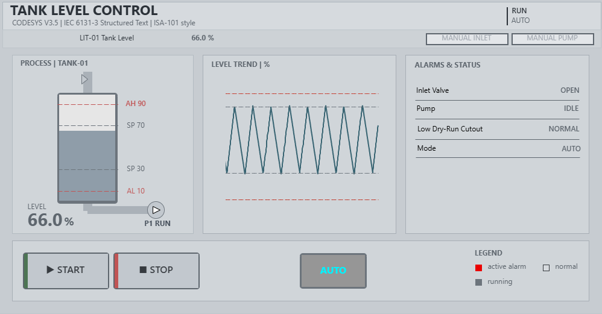
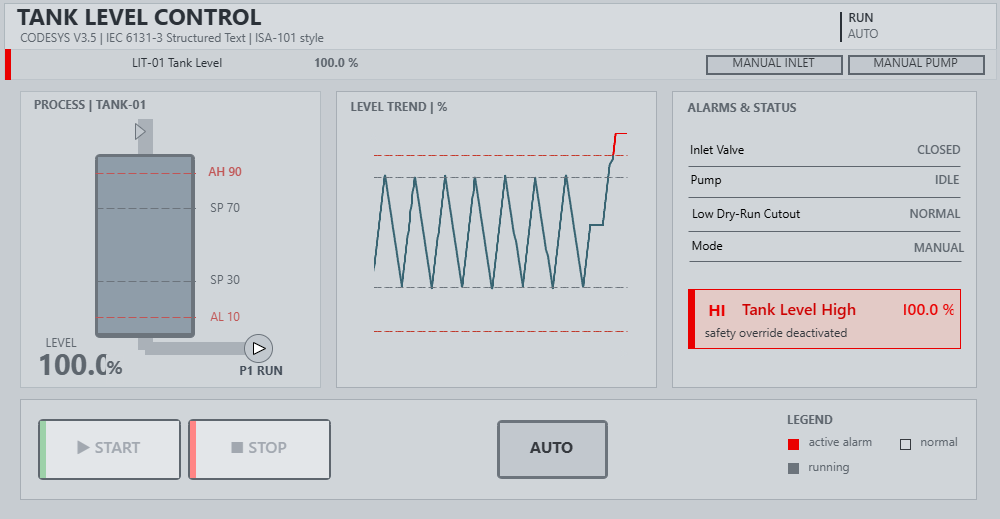

# Tank Level Control — PLC + HMI (CODESYS)

A small but complete industrial-control project: a simulated water tank kept at a safe level by an inlet valve and an outlet pump, with safety interlocks and an operator HMI. Written in IEC 61131-3 **Structured Text** and built/run entirely in **CODESYS** simulation; no hardware required.

> Built as my first automation project, ahead of starting **Automation Engineering at Politecnico di Milano**.


 <!-- level above AH: red banner + trend excursion -->

## What it does

- **Start / Stop** — edge-detected run latch driven by momentary pushbuttons
- **Auto / Manual modes** — hysteresis control in Auto, direct inlet/pump commands in Manual
- **On-off (hysteresis) level control** — fills below the low setpoint, drains above the high setpoint, holds direction in between
- **Safety overrides** (act on the live signal, always win):
  - **High-level alarm** — closes the inlet and drains the tank
  - **Low-level dry-run cutout** — stops the pump to protect it
- **Latching alarms with operator acknowledge** — an alarm stays annunciated until the condition clears *and* the operator acknowledges it
- **Self-contained process simulation** — a simple inflow/outflow model so the tank behaves realistically with no external I/O
- **ISA-101 / high-performance HMI** — muted palette with colour reserved for abnormal states, live level bar, real-time trend, status indicators, and an acknowledgeable alarm banner

## How it works

The logic runs every scan cycle:

1. **Edge-detect Start/Stop** into a run latch, so a held button is a one-shot instead of re-firing every scan.
2. **In Auto, latch a fill/drain direction.** Flip to *fill* at the low setpoint and *drain* at the high setpoint, then drive the actuators off that latch. This keeps the plant doing something through the dead band, so restarting mid-band resumes the last direction instead of freezing.
3. **Apply safety overrides after control**, gated on the run state, using the *live* alarm condition; protective action follows reality instead of the acknowledged state.
4. **Integrate the tank physics** from the valve/pump state.

```iecst
// edge-detected start/stop latch
IF xStart AND NOT xStartPrev THEN xRunning := TRUE;  END_IF
IF xStop  AND NOT xStopPrev  THEN xRunning := FALSE; END_IF
xStartPrev := xStart;
xStopPrev := xStop;

// auto (direction latch)
IF xRunning = TRUE AND xAutoMode = TRUE THEN
    IF rLevel <= rSP_Low THEN xFilling := TRUE; END_IF   // fill 
    IF rLevel >= rSP_High THEN xFilling := FALSE; END_IF   // drain
    xInletValve := xFilling;
    xPump := NOT xFilling;          // avoid dead-band deadlokc

ELSIF xRunning = TRUE AND xAutoMode = FALSE THEN
    xInletValve := xManInlet; xPump := xManPump;

ELSE
    xInletValve := FALSE; xPump := FALSE;
END_IF

// safety — live condition, gated on running, runs last so it wins
xHighAlarm := rLevel >= rSP_AlarmHigh;
xLowCutout := rLevel <= rSp_AlarmLow;
IF xRunning AND xHighAlarm THEN xInletValve := FALSE; xPump := TRUE; END_IF
IF xRunning AND xLowCutout THEN xInletValve := TRUE;  xPump := FALSE; END_IF
```

## Tech

- **CODESYS V3.5** (IEC 61131-3)
- **Structured Text (ST)** for the control logic
- **CODESYS Visualization** for the HMI (ISA-101 styling, live Trace)
- Runs in **Simulation** mode, no PLC hardware needed

## Run it

1. Open the project in CODESYS.
2. `Online → Simulation` (toggle on).
3. `Login` (Alt+F8) → download → `Start` (F5).
4. Open the `Main_HMI` visualization and use Start / Auto-Manual to drive it.

## What I learned

- **Momentary vs level signals.** A Start button left latched TRUE re-triggers the run latch every scan; edge detection makes it behave like a real pushbutton.
- **Dead-band deadlock.** Setting both actuators only at the thresholds freezes the plant if you stop inside the hysteresis band. Latching the *direction* instead keeps it moving and lets it restart from anywhere.
- **Live action vs latched annunciation.** The physical override should track the live condition; only the operator-facing alarm latches until acknowledged. Mixing the two makes the safeties lie.
- **Think in scan cycles.** Order matters, so safety runs *after* control so it can't be silently overwritten, and inverse HMI flags are computed last so the display matches the final state.
- **Colour is information (ISA-101 similar).** Normal is grey; colour means something needs attention. Reserving red for real alarms makes the one that matters impossible to miss.

## Next steps

- PID control on a modulating valve
- ESD (emergency shutdown) interlock
- Alarm prioritisation / first-out annunciation
- Port to Siemens TIA Portal (STEP 7 + WinCC)

## Author

**Matteo Zocchi** — Automation Engineering, Politecnico di Milano
[LinkedIn](https://linkedin.com/in/matteo-zocchi)
